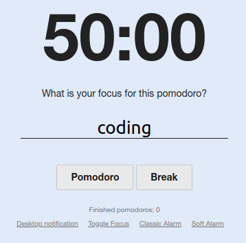

# Pomodoro

A simple Javascript, HTML and CSS pomodoro timer.

Can be seen live at [https://pomodoro.kartones.net](https://pomodoro.kartones.net).

Querystring options supported:

- `theme=dark`: forces dark theme (automatically set if detected at OS/webbrowser level)
- `t=xx` : sets the pomodoro timer to xx minutes (default 25)
- `b=yy` : sets the break timer to yy minutes (default: 5)
